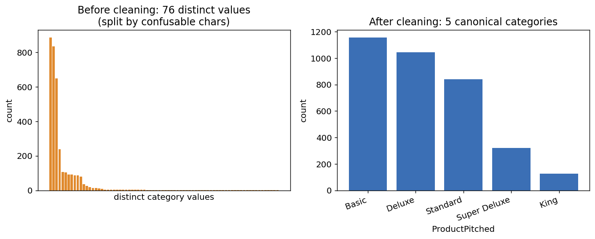
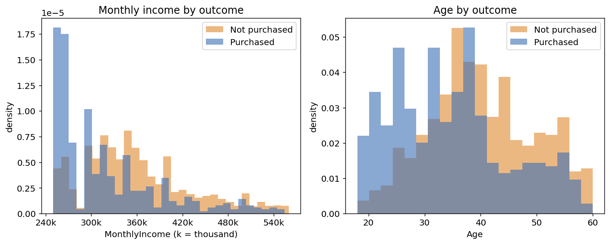
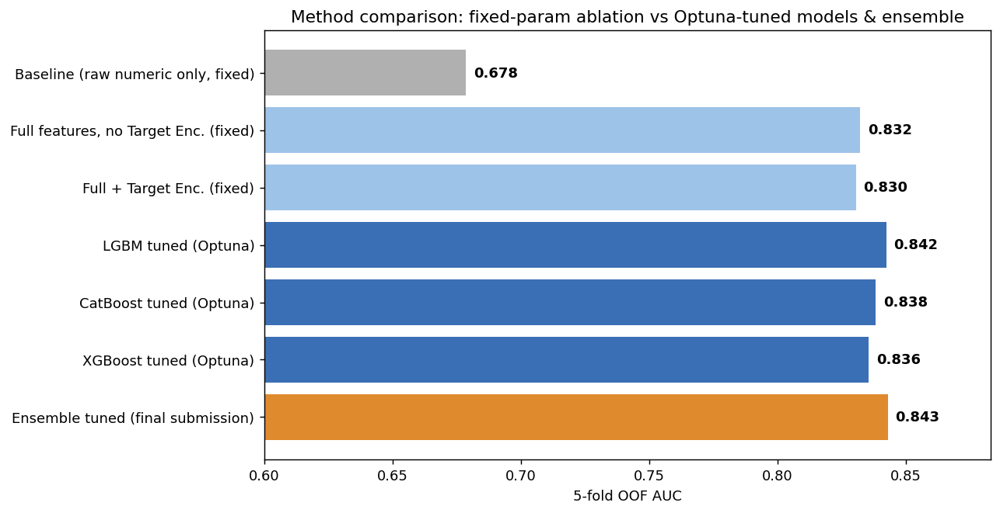
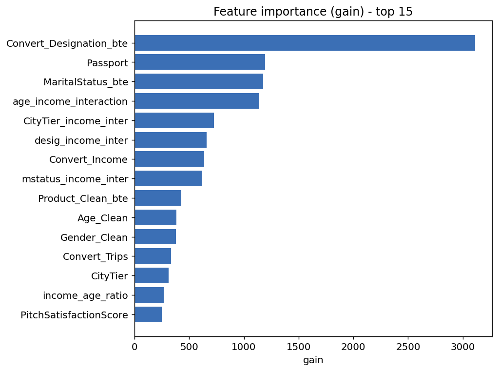

# 旅行パッケージ成約率予測（SIGNATE コンペティション）

旅行会社の**不完全な顧客データベース**から、旅行パッケージの成約率を予測する二値分類タスク。
データに表記揺れ・混同文字・欠損・外れ値が**意図的に混入**しており、「綺麗なデータが渡されない実務」を想定した前処理が課題の中心。

## 🏆 結果

| 項目 | 内容 |
|---|---|
| 順位 | **31位 / 392（上位約8%）** |
| Public AUC | **0.846** |
| Private AUC | **0.843** |
| 評価指標 | AUC（ROC曲線下面積） |

> 5-fold OOF AUC（手元の交差検証）も **0.843** で、本番 Private スコアとほぼ一致。
> → 過学習やリークがなく、検証設計が妥当だったことを示す。

---

## 課題とアプローチ

旅行会社がマーケティングコストを下げるため、「購入しそうな顧客」を予測して施策の優先順位づけに活用したい、という設定。
予測精度だけでなく、**汚いデータを実務的に整える前処理**と、**本番で再現できる検証設計**を重視した。

### パイプライン全体像

```
raw csv
 └─ クレンジング        … 表記揺れ・混同文字・桁ずれを正規化
 └─ 欠損補完            … 列の性質ごとに方法を使い分け
 └─ 特徴量エンジニアリング … 仮説・回帰・交互作用
 └─ エンコーディング     … Target Encoding（OOFでリーク対策）
 └─ モデリング          … LightGBM / CatBoost / XGBoost + Optuna
 └─ アンサンブル        … OOF予測を重み最適化（Nelder-Mead）
```

全工程を **`fit` / `transform` で分離**し、学習データの統計をテストへ漏らさない設計（データリーク対策）。

---

## 主な工夫

### 1. データクレンジング（本コンペの主眼）

混同文字（キリル・ギリシャ・全角）でカテゴリが **76種に分裂** → 正規化で本来の **5種** に統合。



- `Age`：「50歳 / 50才 / 五十 / 50代」を数値化し 18〜60 にクリップ
- `ProductPitched` / `Designation`：混同文字マップ ＋ NFKC正規化
- `NumberOfTrips`：「月に3回」などの頻度表現を年間回数に換算
- `customer_info`：フリーテキストから婚姻状況・車所有・子供数を抽出

### 2. リーク対策（fit / transform 分離）

前処理・特徴量・エンコードをすべて `fit_transform()`（学習用）と `transform()`（推論用）に分離。
中央値・回帰係数・ビン境界・ターゲット平均などの統計量は**学習データだけ**から計算する。

### 3. 仮説ドリブンな特徴量エンジニアリング

「年齢の割に高/低収入か」「富裕都市×高収入」などのビジネス仮説を特徴量化し、分布で裏付け。



- 年齢→収入の回帰残差・比、役職×収入・年齢×収入などの交互作用
- ターゲットエンコーディングは **Out-of-Fold (OOF)** で生成しリークを防止

### 4. モデリング・チューニング・アンサンブル

LightGBM / CatBoost / XGBoost を Optuna でチューニングし、OOF予測を重み最適化してアンサンブル。



| 構成 | 5-fold OOF AUC |
|---|---|
| ベースライン（生の数値のみ） | 0.678 |
| ＋クレンジング＋特徴量（固定パラメータ） | 0.832 |
| ＋ターゲットエンコーディング（固定） | 0.830（ほぼ中立） |
| Optunaチューニング（単独最強 LGBM） | 0.842 |
| **アンサンブル（最終提出）** | **0.843** |

> ターゲットエンコーディングはLGBMでは中立だった。「効くと思った手法も検証して中立なら正直に記録する」方針で、ablationとして残している。

#### 効いた特徴量



重要度の上位は、役職のターゲットエンコードや「役職×収入」「年齢×収入」など**自作の特徴量**が占めた。

---

## ディレクトリ構成

```
travel-package/
├── main.py                      # 実行エントリポイント（CV / 提出）
├── src/
│   ├── preprocessing/
│   │   ├── cleaning.py          # 表記揺れ・混同文字の正規化
│   │   └── imputation.py        # 欠損値補完（fit/transform分離）
│   ├── features/
│   │   ├── basic_features.py    # 回帰・ビニング・交互作用
│   │   ├── categorical_features.py  # Target / Label Encoding（OOF）
│   │   └── advanced_features.py # エンコード後の交互作用特徴量
│   ├── models/
│   │   ├── lgb_trainer.py       # LightGBM（Optuna + K-Fold）
│   │   ├── cat_trainer.py       # CatBoost
│   │   ├── xgb_trainer.py       # XGBoost
│   │   └── ensemble.py          # 重み最適化アンサンブル
│   └── utils/                   # 可視化・メモリ最適化
├── make_figures.py              # 図の生成（クレンジング前後・分布・重要度）
├── run_experiments_tuned.py     # 手法比較の検証（Optunaチューニング込み）
├── SUMMARY.md                   # 取り組みの技術まとめ
└── assets/                      # README用の図
```

---

## 実行方法

[uv](https://github.com/astral-sh/uv) で環境を構築。

```bash
# 依存パッケージを同期
uv sync

# 交差検証（CV）で手元スコアを確認
python main.py --model lgbm --mode cv --trials 40

# 提出ファイルを生成（アンサンブル）
python main.py --model ensemble --mode submit --trials 40
```

| 引数 | 説明 |
|---|---|
| `--model` | `lgbm` / `catboost` / `xgboost` / `ensemble` |
| `--mode` | `cv`（交差検証）/ `submit`（提出ファイル生成） |
| `--trials` | Optuna の試行回数 |

> ※ コンペデータ（`data/`）は再配布不可のためリポジトリには含めていません。

---

## 技術スタック

- **言語 / 基盤**：Python, pandas, NumPy, scikit-learn
- **モデル**：LightGBM, CatBoost, XGBoost
- **チューニング / 評価**：Optuna, StratifiedKFold, SHAP
- **設計**：クラスベースのパイプライン（fit/transform分離によるリーク対策）

## 学び・今後の改善余地

- 汚い実データを構造化する前処理の引き出しと、再現性あるパイプライン設計
- 改善余地：不均衡対応（`scale_pos_weight`・しきい値最適化）、Optunaのseed固定による完全な再現性、SHAPによる説明可能性の強化
